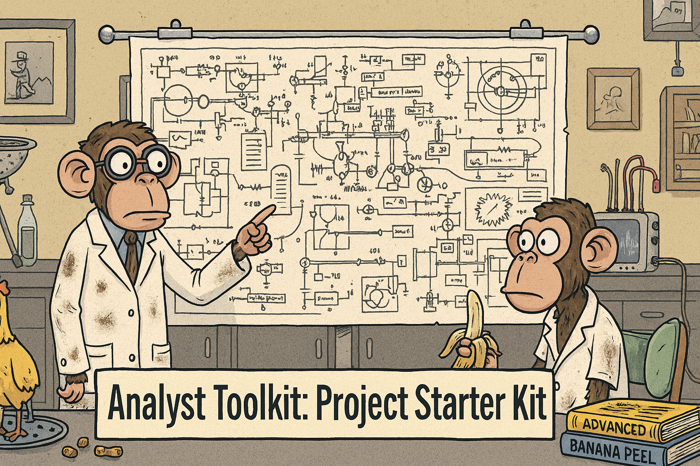

<p align="center">
  
  <br>
  <em>Analyst Toolkit — Starter Kit</em>
</p>

<p align="center">
  
  
  
  <a href="https://github.com/G-Schumacher44/analyst_toolkit_starter_kit/releases/latest/download/deploy_toolkit.zip">
    
  </a>
  
</p>

## Analyst Toolkit Starter Kit

Starter repo to deploy and use the Analyst Toolkit fast. It includes a deployment bundle (`deploy_toolkit.zip`) and docs to scaffold a project, ingest a CSV, infer starter configs locally, and run via notebook or CLI.

[`⬇️ Download the latest release`](https://github.com/G-Schumacher44/analyst_toolkit_starter_kit/releases/latest/download/deploy_toolkit.zip)

👀 [`Checkout the Analyst Toolkit`](https://github.com/G-Schumacher44/analyst_toolkit) on GitHub

## 🧩 TL;DR

- [`Browse Releases`](https://github.com/G-Schumacher44/analyst_toolkit_starter_kit/releases/latest)
- Unzip `deploy_toolkit.zip` at repo root
- Create env: `conda env create -f environment.yml && conda activate analyst-toolkit`
- Put a CSV at repo root or `data/raw/`
- Run: `make setup PROJECT_NAME=<name> DATASET=auto`
- Launch: `make notebook`

See: `tool_kit_resources/deployment_guide.md`, `tool_kit_resources/usage_guide.md`, `tool_kit_resources/config_guide.md`.

## 🧭 Explore Repo / Quick Start

- Deployment Guide: `tool_kit_resources/deployment_guide.md`
- Usage Guide: `tool_kit_resources/usage_guide.md`
- Config Guide: `tool_kit_resources/config_guide.md`
- Env files: `.env.example`, `environment.yml`, `requirements.txt`

Quick start commands:
```bash
conda env create -f environment.yml
conda activate analyst-toolkit
make setup PROJECT_NAME=my_project DATASET=auto
make notebook
```
## 🧭 Orientation & Getting Started

<details>
<summary><strong>🧠 Notes from the Dev Team</strong></summary>

This starter kit focuses on fast, reproducible setup. It does not include the full source for the Analyst Toolkit — that is installed as a dependency (see `environment.yml` / `requirements.txt`). The deployment bundle scaffolds folders, wires your dataset, and generates suggested configs locally (privacy‑safe) so you can run the notebook‑first workflow immediately.
</details>

<details>
<summary><strong>📦 Starter Bundle Contents</strong></summary>

Inside `deploy_toolkit.zip` (after unzipping at repo root):
- `Makefile` — setup, wire data, configs, notebook, package
- `templates/` — config, env, VS Code, and notebook templates
- `scripts/bootstrap.sh` — notebook‑first bootstrapper
- `tool_kit_resources/` — local docs
</details>

<details>
<summary><strong>⬇️ Get the Bundle</strong></summary>

- One‑click download (latest):
  https://github.com/G-Schumacher44/analyst_toolkit_starter_kit/releases/latest/download/deploy_toolkit.zip
- Or view Releases page:
  https://github.com/G-Schumacher44/analyst_toolkit_starter_kit/releases/latest
- Or download the workflow artifact (deploy_bundle) from Actions:
  https://github.com/G-Schumacher44/analyst_toolkit_starter_kit/actions/workflows/release-bundle.yml
  (open the latest successful run and download the artifact)
- Or build locally: `make -f deploy_toolkit/Makefile_master package`

</details>

<details>
<summary><strong>ℹ️ About the <code>deploy_toolkit</code> folder</strong></summary>

The <code>deploy_toolkit/</code> folder in this repo is the versioned source/sample of the deployment bundle. When you unzip the bundle into your own project, Git ignores the entire <code>deploy_toolkit/</code> folder (and zip files) by default, so you can leave it in place without cluttering your repo.

To rebuild the bundle locally from this repo:

```bash
make -f deploy_toolkit/Makefile_master package
```

This produces a fresh zip while excluding data/ and exports/.
</details>

<details>
<summary>📐 What’s Included</summary>

- `deploy_toolkit.zip` — deployment bundle (see above)
- `tool_kit_resources/` — guides (deployment, usage, config, notebooks)
- `environment.yml` / `requirements.txt` — reproducible env
- `.env.example` — template env variables
- `repo_img/` — repo images used in docs
- `LICENSE`, `README.md`
</details>

<details>
<summary><strong>🫆 Version Release Notes</strong></summary>

v0.2.1
- Cross-platform packaging (Python-based; no external zip needed)
- Windows support: `setup.cmd`, `py -3` fallback, Git Bash guidance
- Root `Makefile` delegator; direct `-f Makefile_master` fallback in docs
- `.gitignore` ignores `deploy_toolkit/` and zips by default
- Release workflow attaches `deploy_toolkit.zip` to tagged releases

v0.2.0
- First public Starter Kit
- Deployment bundle + docs consolidation
- Image/link fixes; safe defaults via `.env.example`
</details>

<details>
<summary>⚙️ Project Structure</summary>

```
analyst_toolkit_starter_kit/
├── deploy_toolkit.zip           # Deployment bundle
├── environment.yml              # Conda environment (analyst-toolkit)
├── requirements.txt             # Pip alternative
├── .env.example                 # Template env vars
├── tool_kit_resources/          # Local guides
├── repo_img/                    # Repo images
├── LICENSE
└── README.md
```

</details>

<details>

<summary>🛠️ Make Targets (bundle)</summary>

Common targets after unzipping `deploy_toolkit.zip`:
- `make setup PROJECT_NAME=<name> DATASET=auto|prompt|/path.csv`
- `make wire-data DATASET=auto|prompt|/path.csv`
- `make configs INPUT=data/raw/your.csv`
- `make notebook`
- `make package`

</details>

___


### 🛠 Environment Setup

Install dependencies using one of the following methods:

Option 1 — Conda (recommended)
```bash
conda env create -f environment.yml
conda activate analyst-toolkit
```
Option 2 — pip
```bash
pip install -r requirements.txt
```

Notes
- The toolkit package is installed from GitHub as a dependency.
- Data and exports are git‑ignored by default; use `.env.example` to set run defaults if needed.

Windows Notes
- Recommended: use WSL (Ubuntu) and follow Linux steps inside WSL.
- Native Windows: use Git Bash + Make + Python 3/Conda on PATH.
  - Install Git for Windows (includes Git Bash)
  - Install Make (e.g., `choco install make` or `scoop install make`)
  - Ensure `python` (or `py -3`) works in your shell
  - Easiest: run `setup.cmd` from CMD/PowerShell (opens Git Bash and runs the bootstrap)
  - Or run `make setup` at repo root, or call the bootstrapper directly:
    - `bash deploy_toolkit/scripts/bootstrap.sh --env conda --name analyst-toolkit --copy-notebook --generate-configs --run-smoke`
  - Packaging is cross‑platform now (no external `zip` required)
___

## 🤝 On Generative AI Use

Generative AI tools (including models from Google and OpenAI) were used throughout this project as part of an integrated workflow — supporting code generation, documentation refinement, and idea testing. These tools accelerated development, but the logic, structure, and documentation reflect intentional, human-led design. This repository reflects a collaborative process where automation supports clarity and iteration deepens understanding.


## 📦 Licensing

This project is licensed under the [MIT License](LICENSE).

---

<p align="center">
  <a href="README.md">🏠 <b>Main README</b></a>
  &nbsp;·&nbsp;
  <a href="tool_kit_resources/deployment_guide.md">🚀 <b>Deployment</b></a>
  &nbsp;·&nbsp;
  <a href="tool_kit_resources/usage_guide.md">📘 <b>Usage</b></a>
  &nbsp;·&nbsp;
  <a href="tool_kit_resources/config_guide.md">🧭 <b>Config</b></a>
</p>

<p align="center">
  <sub>✨ Analyst Toolkit · Starter Kit ✨</sub>
</p>
